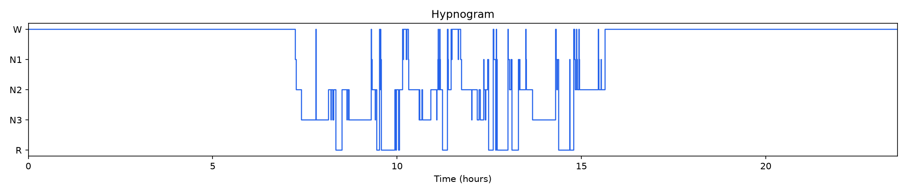
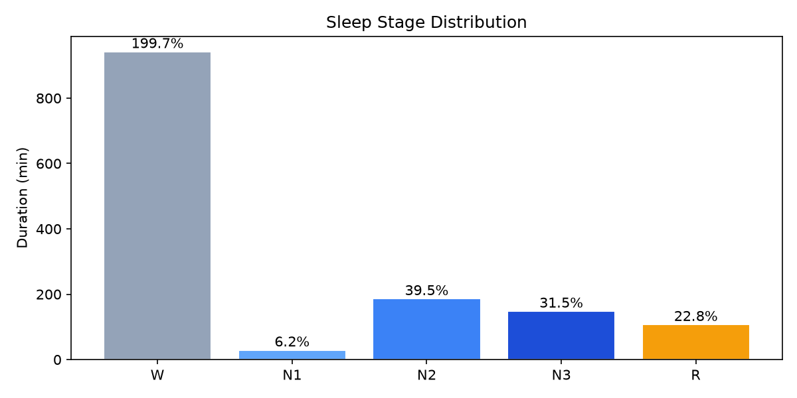
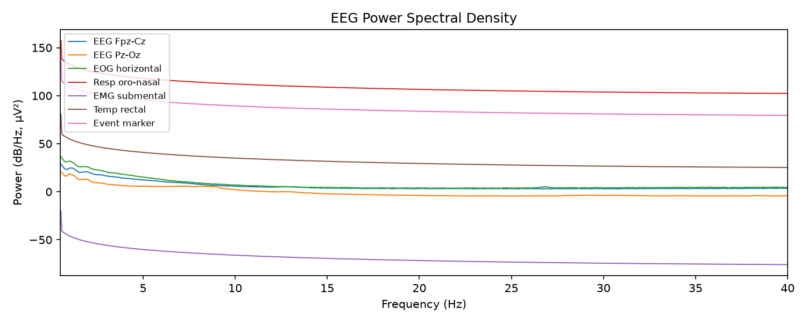
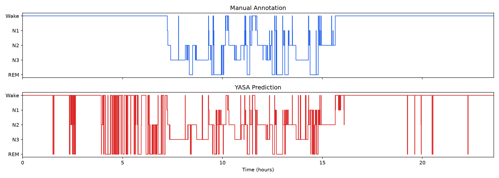
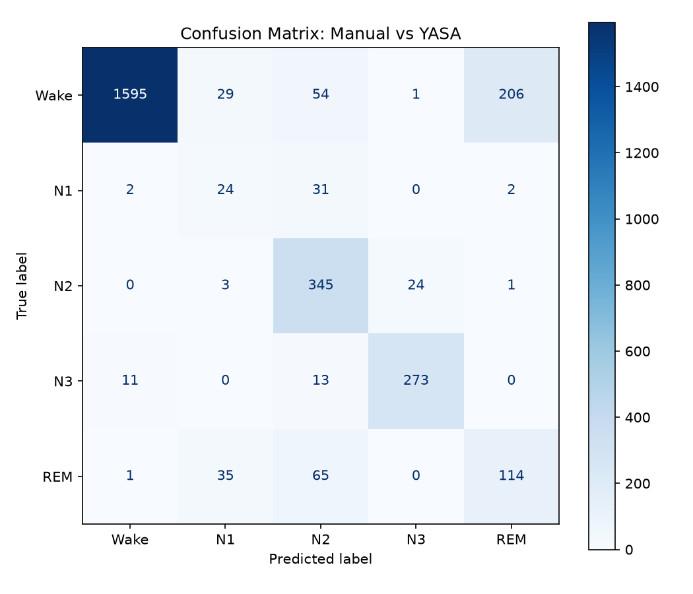

# Sleep Analysis Homework

AI Agent × Biomedical Signal Analysis (2026) — Week 1 Bonus Exercises

## Data

Uses [Sleep-EDF Database](https://physionet.org/content/sleep-edfx/) from PhysioNet:
- `SC4002E0-PSG.edf` — PSG recording (EEG, EOG, EMG, etc.)
- `SC4002EC-Hypnogram.edf` — Expert-annotated sleep stages

---

## Exercise A: Sleep Report (`sleep_report.py`)

Generates an HTML sleep report containing:
- Hypnogram visualization
- Sleep stage duration & percentages (W, N1, N2, N3, REM)
- Sleep efficiency, onset latency, REM latency
- Number of awakenings
- EEG power spectral density

### Usage

```bash
python sleep_report.py \
  --psg data/SC4002E0-PSG.edf \
  --hypnogram data/SC4002EC-Hypnogram.edf \
  --output output
```

Output: `output/sleep_report.html`

### Screenshots — Exercise A

#### Hypnogram


#### Sleep Stage Distribution


#### EEG Power Spectral Density


---

## Exercise B: YASA Auto Sleep Staging (`yasa_staging.py`)

Compares YASA automated sleep staging against manual annotations:
- Processes EEG/EOG/EMG channels
- Runs YASA SleepStaging model
- Generates comparison hypnograms
- Reports Accuracy, Cohen's Kappa, confusion matrix, precision/recall/F1

### Usage

```bash
python yasa_staging.py \
  --psg data/SC4002E0-PSG.edf \
  --hypnogram data/SC4002EC-Hypnogram.edf \
  --output output
```

### Results

| Metric | Value |
|--------|-------|
| Accuracy | 83.1% |
| Cohen's Kappa | 0.707 |

### Screenshots — Exercise B

#### Manual vs YASA Comparison Hypnogram


#### Confusion Matrix


---

## Environment

```bash
conda create -n bioagent python=3.11
conda activate bioagent
conda install -c conda-forge mne yasa matplotlib scikit-learn numpy
```
